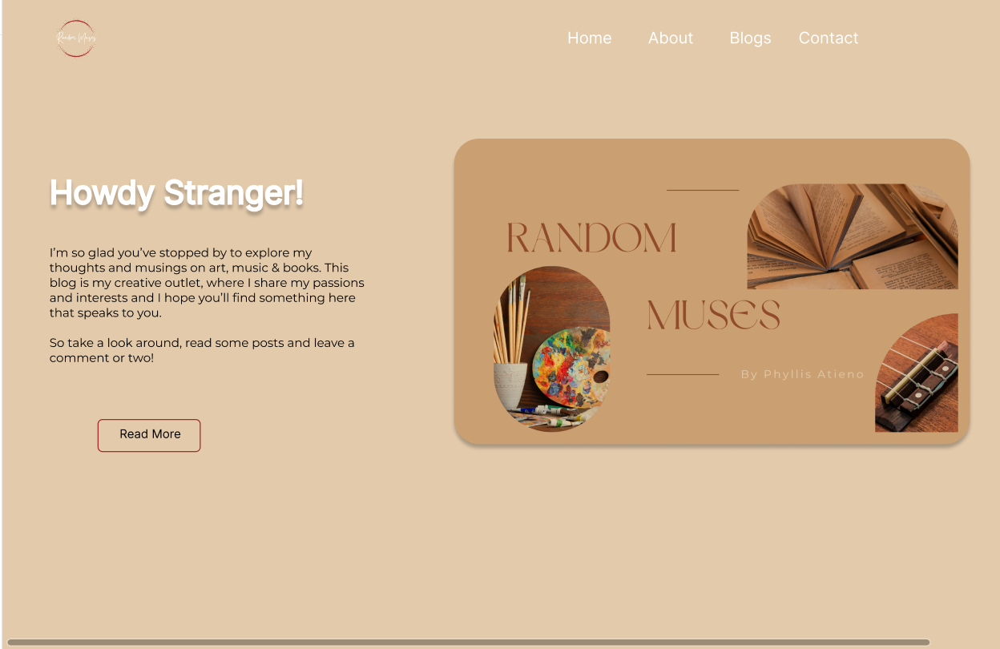

# Random-Muses

## Project Description
Random  Muses is my personal blog that focuses on the three things I love:
1. Music
2. Books
3. Art

And like the name, all the posts are random muses in my daily life :smiley:

## Features
The blog contains the following sections:
1. Home
2. About
3. Blogs
4. Contact

## Design
Here's the Homepage design I created on Figma

## Installation

## Usage

## Contributing
Yes I welcome contributions, so go ahead and create that PR!

## Credits
I give credits to my uke, stock of books(both read and unread) and ofcourse my sketch-pad :wink:
